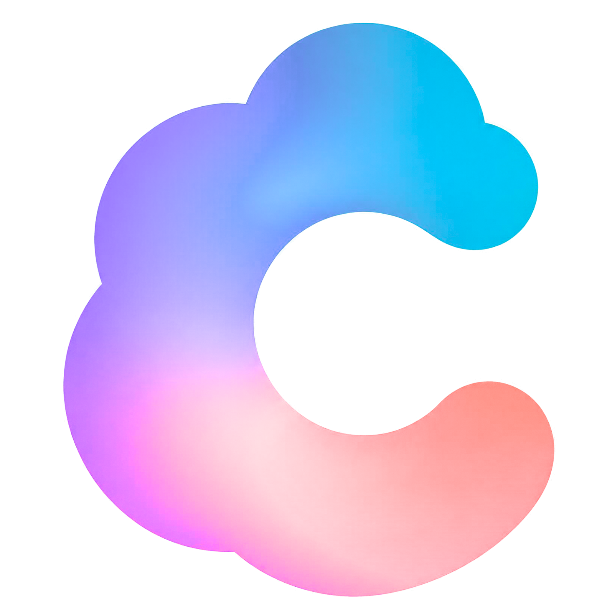
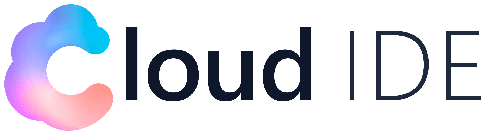

<p align="center">
  
</p>

<h1 align="center">Cloud IDE</h1>
<p align="center"><b>Gömülü sistemler için yapay zekâ destekli, bağımsız masaüstü geliştirme ortamı</b></p>

<p align="center">
  
  
  
  
</p>

<p align="center">
  
  
  
  
  
  
</p>

<p align="center">
  <b>⚡ Gömülü CLI</b> · Sıfır kurulum gerektirir&nbsp;&nbsp;|&nbsp;&nbsp;
  <b>✨ Cloud AI & RAG</b> · Donanıma özel kod zekâsı&nbsp;&nbsp;|&nbsp;&nbsp;
  <b>🤝 Açık İletişim</b> · Geri bildirimlerinize açık
</p>

---

**Cloud IDE**, Arduino IDE'nin temel işlevlerini (kod düzenleme, derleme, karta yükleme, kütüphane/kart yönetimi, seri monitör) modern bir arayüzde birleştirirken; **Cloud AI** ile gömülü sistem geliştirmeye uçtan uca yapay zekâ desteği getirir. Gömülü `arduino-cli` sayesinde harici bir Arduino IDE kurulumuna ihtiyaç duymadan, tek dosyayla her Windows bilgisayarda çalışır.

## 📋 İçindekiler
- [Geliştiriciden](#-geliştiriciden)
- [Özellikler](#-özellikler)
- [Teknoloji Yığını](#-teknoloji-yığını)
- [Ekran Görüntüleri](#-ekran-görüntüleri)
- [Kurulum](#-kurulum)
- [Proje Yapısı](#-proje-yapısı)
- [Yol Haritası](#-yol-haritası)
- [Katkıda Bulunma](#-katkıda-bulunma)
- [Lisans](#-lisans)
- [Geliştirici](#-geliştirici)

## 💬 Geliştiriciden

> "AI ile artık her şeyi yapabilirsiniz, ancak en önemli ve vazgeçilmez olan şey daima insanın yaptığı müdahale, yönlendirme ve özgünlüktür."
>
> — Efe Ali Bozkurt, Cloud IDE Yaratıcısı

Kodlama ve gömülü sistemler bilmeyen insanların dahi aklındaki fiziksel projeleri üretebilmesi, donanım ve yazılım geliştirme önündeki teknik sınırların tamamen kalkması gerektiği düşüncesiyle yola çıkılan bu proje, Cloud IDE'nin vizyonunu oluşturuyor.

## ✨ Özellikler

### 🖊️ Editör
- Monaco Editor tabanlı, sekmeli sketch yönetimi
- AI'nin ürettiği kodu canlı yazım animasyonu ve diff önizlemesiyle gösteren editör deneyimi
- Değişiklikleri tek tıkla **Onayla ✓ / Reddet ✕**

### ⚙️ Derleme & Yükleme
- Sıfır kurulumlu, gömülü `arduino-cli` çekirdeği — harici Arduino IDE gerekmez
- Derleme ve yüklemeyi güvenli şekilde yöneten port yönetimi
- Dahili seri port izleyici

### 🤖 Cloud AI
- Kimi K3 (Moonshot), Gemini, DeepSeek, Claude, ChatGPT ve NVIDIA NIM dâhil çoklu model desteği, canlı akışla
- Sürüklenebilir 3 kademeli muhakeme anahtarı: Düşük ⚡ · Orta 🧠 · Yüksek ⚛️
- Editör ile sohbeti ayıran Agent Eylem Kartları

### 🧠 Yerel RAG Motoru
- Tamamen çevrimdışı çalışan, yerel kod arama ve semantik indeksleme motoru
- AVR, ESP32, Deneyap, RP2040 ve STM32 mimarilerine özel donanım kuralları ve voltaj güvenlik uyarıları

### 🛠️ Özel Beceriler
- Kendi C++ kod parçacıklarını ve mimari kurallarını `.md` dosyaları olarak tanımlama
- Hazır başlangıç şablonları (Deneyap IMU, ESP32 AsyncWebServer, AVR Timer1 CTC, RP2040 çift çekirdek…)

### 📦 Kart & Kütüphane Yönetimi
- Katalog / Kurulu sekmeleriyle kart ve kütüphane yönetimi

## 🧰 Teknoloji Yığını

| Katman | Teknolojiler |
|---|---|
| Masaüstü Çatısı | Electron |
| Arayüz | React 18 · TypeScript · Tailwind CSS · Vite |
| Kod Editörü | Monaco Editor |
| AI / RAG | `@xenova/transformers` |
| Donanım İletişimi | `serialport` |
| Kalıcı Depolama | `electron-store` |
| Paketleme | electron-builder (NSIS Setup + Portable) |
| Gömülü Derleyici | `arduino-cli` v1.5.1 |

## 📸 Ekran Görüntüleri

> _Ekran görüntüleri yakında eklenecek._

<!--
<p align="center">
  
</p>
-->

## 🚀 Kurulum

### Son Kullanıcı
1. [Releases](https://github.com/efealibozkurt/Cloud-IDE/releases) sayfasından güncel `Setup.exe` (kurulum) veya portable `.exe` dosyasını indirin.
2. Kurulum sihirbazını takip edin ya da portable sürümü doğrudan çalıştırın.
3. Harici bir Arduino IDE kurulumuna gerek yoktur — derleyici pakete gömülüdür.

### Geliştirici
```bash
git clone https://github.com/efealibozkurt/Cloud-IDE.git
cd Cloud-IDE
npm install

# Geliştirme modunda çalıştır
npm run dev

# Windows için paketle (NSIS Setup + Portable)
npm run build:win
```

## 🗂️ Proje Yapısı

<details>
<summary>Klasör haritasını göster</summary>

```
Cloud-IDE/
├─ resources/
│  ├─ icon.ico / icon.png
│  └─ arduino-cli/arduino-cli.exe
├─ scripts/
│  ├─ generate-icons.js
│  └─ generate-hd-logos.js
├─ src/
│  ├─ main/
│  │  ├─ services/
│  │  └─ ipc/
│  ├─ preload/
│  ├─ renderer/
│  │  └─ src/
│  │     ├─ assets/
│  │     ├─ components/    # editor, ai, layout, libraries, boards, settings, common
│  │     └─ state/
│  └─ shared/types.ts
└─ electron-builder.yml
```
</details>

## 🗺️ Yol Haritası

**1. Aşama — Şu Anki Durum (v0.1.0 Beta)**
- Sıfır kurulumlu, bağımsız gömülü Arduino CLI çekirdeği
- Cloud AI çoklu model entegrasyonu
- Çift uç nokta esnekliği, akıllı kod düzeltme
- Yerel RAG motoru

**2. Aşama — Gelecek Vizyonu**
- Devre şeması üretiminden pin bağlantılarına
- Simülasyondan donanımın fiziksel testine kadar
- Baştan sona **Full AI destekli** otonom geliştirme modu

## 🤝 Katkıda Bulunma
Katkılar memnuniyetle karşılanır! Bir [issue](https://github.com/efealibozkurt/Cloud-IDE/issues) açabilir veya doğrudan pull request gönderebilirsiniz.

## 📄 Lisans

Copyright © 2026 Efe Ali Bozkurt &lt;iletisim@efealibozkurt.com.tr&gt;

Bu proje **GNU General Public License v3.0 (GPL-3.0)** altında lisanslanmıştır. Ayrıntılı lisans şartları ve yasal haklar için [LICENSE](LICENSE) dosyasına göz atabilirsiniz.

## 👤 Geliştirici

**Efe Ali Bozkurt** — Cloud IDE Yaratıcısı

<p align="left">
  <a href="https://github.com/efealibozkurt"></a>
  <a href="mailto:iletisim@efealibozkurt.com.tr"></a>
</p>

<p align="center">
  <picture>
    <source media="(prefers-color-scheme: dark)" srcset="src/renderer/src/assets/beyaz_cloud_ide.png">
    <source media="(prefers-color-scheme: light)" srcset="src/renderer/src/assets/siyah_cloud_ide.png">
    
  </picture>
</p>
